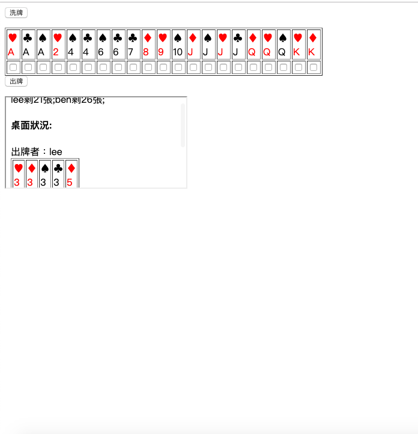

# big-old-two
<h3>故事是這樣的，有一天跟同學打牌的時候不小心把愛心Ｋ放到抽屜然後夾壞了，為了要跟同學賠罪~~~在買不起僕克牌的狀態下~~~只好用免費的php+mysql+javascript做出虛擬版的大老二遊戲．</h3>

如果你也跟我遇到同樣的狀況的話，不要慌張，先建好lamp環境，然後在dbconnect.php輸入mysql帳號密碼，因為此程式很土，沒有setup.php，你必須用phpmyadmin,adminer之類的工具，建出以下結構的資料庫ㄡ．
首先，建一個叫card的資料庫．
         
 In database "card"
                                 
         ---  member  ---  id [int](turn on auto increasement)
         |            |
         |            |
         |            ---  username [varchar size=225]
         |            |
         |            |
         |            ---  password [varchar size=225](以 md5 save）  
         | 
         ---  card    ---  id [int](turn on auto increasement)
         |            |
         |            |
         |            ---  card [varchar size=1000]
         |            
         ---  desk    ---  id [int](turn on auto increasement)
                      |
                      |
                      ---  card [varchar size=1000]
                      |
                      |
                      ---  user [varchar size=255]

然後在table "member" 加入(column)莊家 id=1 (可以洗牌)，並設定帳號and密碼(md5)

在table "member" 加入(column)玩家 id=2 (可以洗牌)，並設定帳號and密碼(md5)

在table "card" 加入(column) id=1 id=2 (card欄位留空)

在table "desk" 加入id=1 id=2 id=3 id=4 id=5 (cardㄝ,user欄位留空)

最後帳密登入

有任何問題可以用telegram問我 （@IForgetMyName12345678）
